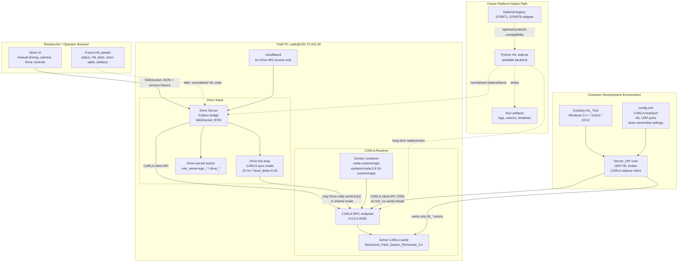

# HIL_Tool Sidecar Integration Plan

Date: 2026-05-29

## Decision

Do not integrate HIL_Tool into the Drive Server for the first integration.

The best and simplest architecture is to run HIL_Tool as a CARLA sidecar client. It should connect directly to the shared CARLA RPC endpoint on port `2000`, while Drive Server keeps owning the browser experience, ego controls, cameras, and CARLA ticking.

This lets the HIL_Tool developer continue working on their field-test/HIL workflow without coupling it to the Drive WebSocket protocol.

## What HIL_Tool Is

HIL_Tool is a Windows C++ PATH Test Manager / Hardware-in-the-Loop broker. It is not just a SUMO co-simulation runner.

It currently does these things:

- Reads SUMO-format `net.xml` road geometry and a large lab `config.xml`.
- Receives and sends UDP messages for traffic simulation, test vehicles, debug vehicles, signals, HIL monitor status, and background vehicles.
- Uses framed binary messages named `START1` through `START8`, ending with `MSGEND`.
- Shows a Windows ImGui/DirectX dashboard with time-space diagrams, speed plots, signal state, test vehicle data, and HIL diagnostics.
- Optionally connects to CARLA and mirrors background vehicles by spawning/updating/destroying CARLA actors.
- Saves trajectory, trajectory-planning, and HIL monitor outputs.

It currently does not actively call CARLA `world.tick()`. Its 20 ms loop is an internal wall-clock update loop, not the CARLA simulation tick.

## Architecture



## Ownership Rules

### Drive Server Owns

- Browser WebSocket on `8765`.
- Camera frames and manual driving UX.
- Ego vehicle lifecycle.
- CARLA synchronous mode and CARLA `world.tick()`.
- Drive-owned actors.
- Drive restart/deployment scripts.

### HIL_Tool Owns

- Its UDP HIL protocol.
- Its test/debug vehicle logic.
- Its HIL plots and local Windows dashboard.
- Its own logs.
- Only actors it creates with an explicit `hil_*` role prefix.

### Shared Boundary

CARLA RPC `:2000` is the shared boundary. Drive Server and HIL_Tool are peer CARLA clients.

## Rules HIL_Tool Must Follow

In shared Path PC mode, HIL_Tool must not:

- Call `world.tick()`.
- Call `ApplySettings()` to change synchronous mode or fixed delta.
- Call `GenerateOpenDriveWorld()` or otherwise replace the active CARLA world.
- Call `load_world()` or reload the map.
- Destroy actors it did not create.
- Assume Drive ego `role_name` equals a numeric HIL vehicle id.
- Bind public UDP ports.
- Write to physical signal controllers without a separate safety review.

HIL_Tool may:

- Connect to CARLA `:2000`.
- Read actors and map state.
- Spawn `hil_*` actors.
- Update transforms/velocities for `hil_*` actors.
- Destroy only `hil_*` actors it owns.
- Read Drive ego state if an explicit role mapping is configured.
- Continue using its Windows dashboard for development.

## Required HIL_Tool Changes

### 1. Add Shared-World CARLA Mode

Current CARLA path calls `GenerateOpenDriveWorld(...)`. That is not safe for the shared Drive endpoint.

Add a config option:

```xml
<carla_world_mode>attach_existing</carla_world_mode>
```

Modes:

- `attach_existing`: connect to current CARLA world and do not reload/generate anything. This is the required Path PC shared mode.
- `generate_from_xodr`: old standalone behavior for isolated experiments only.

Acceptance:

- With `attach_existing`, the active CARLA map remains unchanged.
- Drive UI stays connected.
- CARLA sync mode and fixed delta remain unchanged.

### 2. Tag Every HIL-Owned Actor

When HIL_Tool spawns background vehicles in CARLA, set a role name before spawning:

```text
role_name = hil_background_<sim_vehicle_id>
```

Recommended prefixes:

- `hil_background_*` for background traffic mirrored by HIL_Tool.
- `hil_debug_*` for debug vehicles.
- `hil_test_*` for test vehicle placeholders.

Acceptance:

- HIL_Tool tracks actor ids it created.
- HIL_Tool cleanup destroys only those actor ids or actors with `hil_*` role names.
- HIL_Tool never destroys Drive ego, Drive cameras, `trajectory`, or `dynamic_geofence` actors.

### 3. Add Ego Role Mapping

The current code searches for CARLA actors where `role_name == std::to_string(vehId)`.

That should become explicit config:

```xml
<carla_ego_mappings>
  <mapping hil_vehicle_id="10" carla_role_name="ego_vehicle"/>
</carla_ego_mappings>
```

If there is no mapping, HIL_Tool should run background/monitor-only and not assume it can find or control an ego.

Acceptance:

- Missing mapping is a warning, not a crash.
- HIL_Tool can read mapped ego state.
- HIL_Tool does not write controls to Drive ego in shared mode.

### 4. Keep Tick And World Settings Read-Only

The existing tick/settings code is commented out. Keep it disabled in shared mode.

Acceptance:

- No active calls to CARLA `Tick`, `WaitForTick`, `ApplySettings`, `LoadWorld`, or `GenerateOpenDriveWorld` in shared mode.
- Drive remains the only CARLA tick owner.

### 5. Add A Shared-Mode Startup Check

Before enabling CARLA interaction, HIL_Tool should print and validate:

- CARLA host and port.
- CARLA client/server version.
- Active map name.
- World sync mode.
- Fixed delta.
- `carla_world_mode`.
- Actor role prefix.

Acceptance:

- Startup output clearly says `attach_existing`.
- Startup output shows the active map is the expected shared map.
- If the map is wrong, HIL_Tool exits or asks for confirmation instead of generating a new world.

## Recommended HIL Config For Path PC

Use the Path PC Tailscale address from coworker machines:

```xml
<carla_interface>
  <carla_host>100.72.252.40</carla_host>
  <carla_port>2000</carla_port>
  <carla_world_mode>attach_existing</carla_world_mode>
  <actor_role_prefix>hil</actor_role_prefix>
</carla_interface>
```

If HIL_Tool runs directly on Path PC, `127.0.0.1:2000` is also acceptable.

Do not enable background CARLA mirroring until the shared-world and actor-prefix changes are in place. In the current sample config, `bkg_traffic_query_method` is `0`, so CARLA mode is effectively off by default.

## Coworker Next Steps

### Step 1: Confirm Build Environment

Use Windows for the current HIL_Tool app.

The current repo is Windows-only:

- Visual Studio solution/project.
- Win32 and DirectX12 GUI.
- Winsock sockets.
- Windows `.lib` dependencies.

Mac development is not practical for the existing app. Mac can be used for Drive, docs, mocks, or a future Python sidecar.

### Step 2: Add Shared-World Mode

Implement `attach_existing` mode so HIL_Tool connects to the active CARLA world instead of generating one from OpenDRIVE.

Definition of done:

- HIL_Tool connects to Path PC CARLA.
- Active map is unchanged.
- Drive UI remains connected.
- No CARLA world reload happens.

### Step 3: Add Actor Ownership Prefixes

Set role names on every HIL-spawned actor and track their CARLA actor ids.

Definition of done:

- Spawned actors are visible in CARLA as `hil_*`.
- Cleanup removes only `hil_*`.
- Drive actors survive HIL_Tool start/stop.

### Step 4: Add Ego Mapping But Keep Monitor-Only First

Add config mapping from HIL vehicle id to CARLA `role_name`.

Definition of done:

- HIL_Tool can read a mapped ego if present.
- Missing mapping does not crash.
- HIL_Tool does not control the Drive ego.

### Step 5: Run A Smoke Test Against Path PC

Smoke test sequence:

1. Start CARLA container on Path PC.
2. Start Drive Server and open `/drive`.
3. Start HIL_Tool in `attach_existing` mode.
4. Verify HIL_Tool logs active map and CARLA versions.
5. Spawn one `hil_background_smoke` actor.
6. Verify Drive camera and controls still work.
7. Stop HIL_Tool.
8. Verify only the HIL actor was destroyed.
9. Verify Drive remains connected.

Expected result:

- No map reload.
- No CARLA tick conflict.
- No Drive actor cleanup.
- No Drive WebSocket outage.

### Step 6: Decide Whether Legacy UDP Compatibility Is Needed

If existing traffic/test-vehicle clients already speak `START1` through `START8`, keep that protocol in HIL_Tool.

If not, do not add more binary protocol work yet. Use a simpler JSON/logging path for early integration.

## Future Python Remake

A Python remake is feasible and likely the right long-term platform direction, but it should not be a line-by-line port of the Windows app.

Recommended Python scope:

- Headless CARLA sidecar.
- Config loader.
- UDP adapter only if needed.
- `hil_*` actor ownership.
- HIL metrics and logs.
- Artifact output.
- Normalized state for future Drive dashboard panels.

Keep the Windows HIL_Tool as the reference implementation while the Python sidecar grows.

## When To Stop And Coordinate

Coordinate before making any change that requires HIL_Tool to:

- Tick CARLA.
- Change CARLA synchronous mode or fixed delta.
- Reload or generate the CARLA world.
- Control the Drive ego.
- Open public UDP ports.
- Write to physical signal controllers.
- Replace Drive's CARLA container or map.

Those requirements turn this from a sidecar integration into an exclusive experiment mode, and Drive must explicitly hand off ownership.

## Summary

The immediate integration path is:

```text
HIL_Tool on Windows -> CARLA :2000 directly
Drive UI/Server -> CARLA :2000 directly
Drive owns tick
HIL_Tool owns only hil_* actors
No Drive Server integration yet
```

This gives the HIL developer maximum independence while keeping the Drive Server stable.
